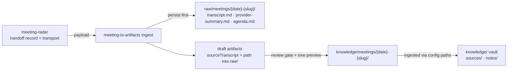

# Design: retro — extracted artifacts routed to `raw/`, verbatim sources never persisted

> Phase 2 of 3 (requirements → design → tasks). Derives from the approved
> requirements. MUST be reviewed and approved before moving to tasks breakdown.

> **Retroactive spec.** Backfilled onto PR
> [#14](https://github.com/MadaraUchiha-314/alter-ego/pull/14) (see
> `requirements.md`); approval happens via the PR review.

## Overview

Fix the layer inversion by making the taxonomy first-class in config and process:
a new `storage.rawSources` destination materializes the verbatim layer at Ingest, all
extraction defaults move to `knowledge/meetings/`, and every consumer (vault
ingestion, radar dedup) resolves paths from config instead of hardcoding
`raw/meetings/`. Consent moves from "default + notify" to explicit questions (init's
taxonomy question, meeting-to-artifacts' missing-config confirmation, a tree preview
at the review gate). `alter-ego:upgrade` carries existing repos across. Recorded as
decision-017 (amending decision-012's reading of `raw/`).

## Architecture

The pipeline seam stays radar → meeting-to-artifacts → knowledge-management
(decision-015); only where each stage's output lands changes:

## Components & interfaces

- **meeting-to-artifacts** — `config.schema.json` gains `storage.rawSources`
  (destination, default `raw/meetings/{date}-{slug}/`, stable filenames); artifact
  defaults and `effectivenessLog` move to `knowledge/meetings/`; SKILL steps 1
  (persist-first), 5 (tree preview), 6 (new defaults table); missing config →
  confirm layout. Contract (`reference/knowledge-base-compat.md`) item 6 redefines
  `sourceTranscript` as a repo-relative path.
- **meeting-radar** — handoff completes only once the receiver persists the payload;
  ledger row gains the persisted-source path; dedup and `processedLog` default follow
  the configured tree.
- **knowledge-management** — `reference/ingestion.md` `meeting-artifact` origin
  locates the tree via the producer's config; `vault-layout.md` reflects the amended
  taxonomy.
- **init** — config-offer step asks the taxonomy question via `AskUserQuestion` and
  writes the answer into config; detection recognizes new + legacy trees.
- **upgrade** — new `reference/layout-migration.md` (detect → move → backfill →
  rewrite → update configs → stamp), wired into plan/migrate steps.

## UI/UX design

N/A — markdown skill plugin, no user-facing surface.

## Data models

`config.schema.json` deltas only: `storage.rawSources` (reuses the existing
`artifactDestination` union), changed defaults for `effectivenessLog`
(meeting-to-artifacts) and `handoff.processedLog` (meeting-radar). Key names are a
public interface; nothing was renamed or removed, so existing configs stay valid —
their values just point at the old layout until migrated.

## Error handling

- Source not persistable → say why, fall back to URL in `sourceTranscript` (R1.2).
- Missing config → ask, don't default (R5.2).
- Migration backfill irrecoverable → report, never fabricate a source.

## Testing strategy

This is a markdown/JSON-schema plugin with no executable code paths; verification is
mechanical consistency checking rather than unit tests: JSON schemas parse, example
YAML configs parse, and no stale `raw/meetings` artifact-path references remain
outside the verbatim-source layer, legacy-migration mentions, and historical decision
records. Behavioural requirements are enforced by the skill texts themselves and
exercised at run time behind their review gates.

## Trade-offs & decisions

- `knowledge/meetings/` sits beside the vault's own folders rather than inside
  `sources/` — producers still never write into the vault (decision-004); the vault
  ingests the tree. Logged as decision-017, with rejected alternatives (rename `raw/`,
  write into `sources/`, keep "defaults + notify").
- Changed defaults are breaking for repos on the old layout — accepted, paid for by
  the upgrade migration (R8).

## Open questions

None open — the eight retro updates were all in scope and implemented.
